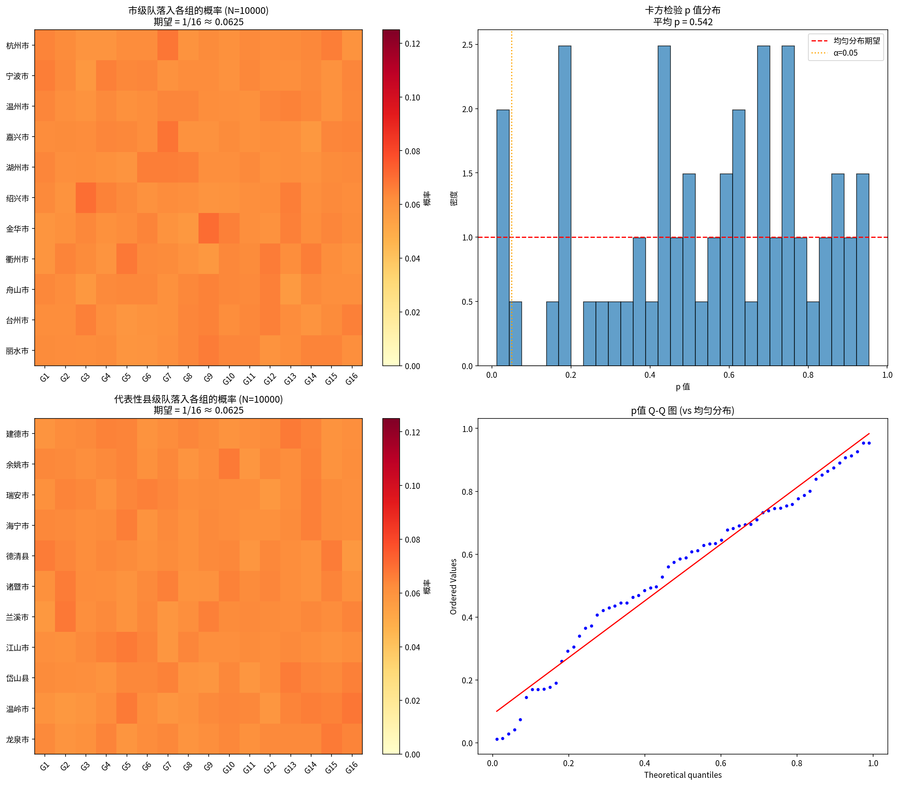
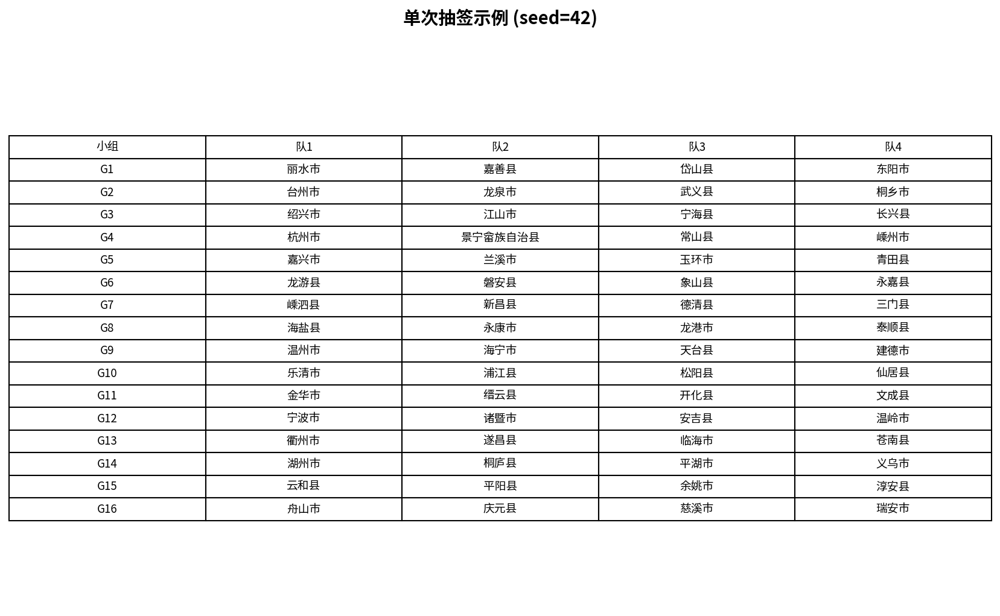
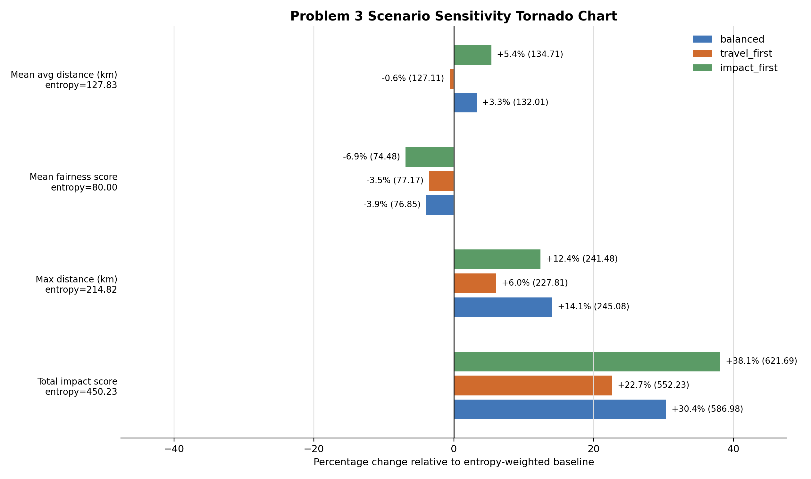
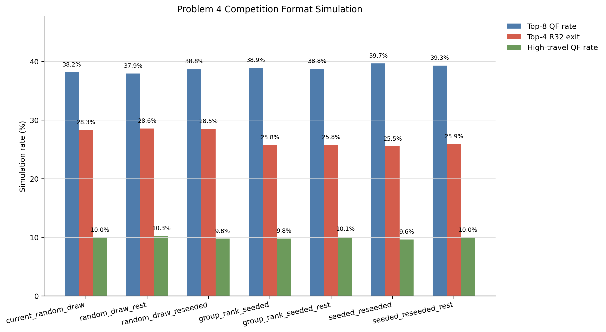

# “浙超”分组方案、抽签机制、赛点选择与赛制优化的一体化研究

> 正式提交说明：第 1 页应替换为学校统一封面；摘要单独成页并作为第 2 页；正文从摘要之后开始编排页码；程序代码、运行命令、自主查阅数据与 AI 使用说明统一放入附录或支撑材料。

---

## 封面页占位

此页用于替换为学校官方封面。

## 摘要

针对“浙超”联赛 64 支队伍的小组分组、抽签公平性、比赛地点选择及赛制优化问题，本文构建了一套“分组生成—公平抽签—赛点配置—赛制优化”的一体化建模框架，将题目四问联结为一条可复现、可解释、可扩展的决策链。对于问题 1，本文将题目要求拆分为“市级队分散、直属回避、同市县级队尽量分散”三类约束，建立带硬约束与软约束的组合优化模型，并设计“市级队随机落位 + 县级队按约束紧度逐步安置”的随机启发式算法，在 500 次搜索中获得 450 个可行方案。最优方案实现了同市县级队同组冲突对数为 0、平均城市来源熵为 2.0000、各组总实力标准差为 6.2099，表明该方案在公平性、分散性与竞技均衡性之间达到了较好平衡。对于问题 2，本文设计分阶段等概率抽签流程，并通过 10000 次蒙特卡洛模拟和卡方检验验证其公平性。结果显示，64 支队伍的平均 p 值为 0.5418，无队伍出现 `p < 0.01` 的显著偏差，仅有 4 支队伍满足 `p < 0.05`，与纯随机条件下的正常波动一致，因此抽签方案在统计意义上公平、透明且具有可实施性。对于问题 3，本文基于浙江省 64 个参赛地区的人口、GDP、交通、体育基础、铁路与机场可达性、代表性场馆容量等数据，构建熵权多目标离散设施选址模型，将“平均旅行距离、最远旅行距离、公平性、赛事影响力、承办能力”统一纳入综合效用函数，最终推荐三门县、诸暨市、仙居县、丽水市、义乌市、东阳市、磐安县和金华市 8 个赛点，平均分配距离为 127.83 km，最大距离为 214.82 km，且无主场惩罚触发，说明所给赛点方案同时兼顾了参赛便利、公平分布与赛事传播效应。对于问题 4，本文根据地区综合指标构建队伍实力代理值，并引入基于旅行负担的疲劳项，搭建包含小组赛、淘汰赛、加时赛与点球大战的比赛仿真模型，对 7 类候选赛制进行了 20000 次蒙特卡洛比较。结果表明，`seeded_reseeded` 方案在优先级加权 TOPSIS 下得分最高，为 0.822888；与当前随机赛制相比，该方案将前 4 强队在 32 强首轮出局概率由 0.2831 降至 0.2551，将前 8 强队进入八强的概率由 0.3817 提高到 0.3968，说明“32 强种子保护 + 16 强后复排”能够更有效减少强队过早相遇。进一步地，本文从约束处理、指标体系、疲劳建模和敏感性分析四个方面提出模型改进：将问题 1 从单一可行性搜索提升为多方案比较；将问题 3 从单纯地理邻近扩展为多目标离散选址；将问题 4 从静态对阵比较提升为带旅行疲劳的动态仿真；并对权重与参数变化进行了稳健性检验。研究表明，本文方法不仅能够解决本题，还可推广到区域足球联赛、校际联赛和其他多赛点淘汰类赛事的赛务组织决策。

**关键词：** 分组优化；公平抽签；设施选址；蒙特卡洛模拟；熵权法；TOPSIS

## 1 问题重述

“浙超”联赛共有 64 支队伍参赛，其中包括 11 支市级队、20 支县级市队和 33 支县队。比赛分为两个阶段：第一阶段为 16 个小组、每组 4 队的单循环小组赛，小组前两名晋级；第二阶段为 32 强淘汰赛，经过 5 轮决出冠军。题目要求分别解决以下四个问题：

1. 在满足行政回避和分散原则的前提下给出若干可行分组方案，并比较其优劣。
2. 设计公平、透明且可实施的抽签流程，并验证其公平性。
3. 根据分组结果选择 8 个比赛地点，每个赛点承办 2 个小组，兼顾公平、便利和赛事影响力。
4. 结合足球比赛特征，利用数学模型与定量分析对赛制提出改进建议。

这四个问题具有明显的前后依赖关系：问题 1 的分组结果决定问题 2 的合法抽签空间，也为问题 3 的赛点选择提供输入；问题 3 的出行负担又会影响问题 4 的疲劳与赛制评价。因此，本文不将四问割裂处理，而是构建统一的一体化建模框架。

## 2 问题分析

问题 1 本质上是一个大规模带约束分配问题。若直接枚举 64 支队伍分入 16 个小组的所有方案，其组合规模极为庞大，不可能通过穷举获得结果。因此需要构造能快速生成可行解并支持多方案比较的启发式算法。

问题 2 的难点并不在于“抽出一个合法分组”，而在于要证明抽签规则对所有队伍没有系统性偏置，即长期运行下的边际分配概率应接近均匀。因此仅给出抽签流程还不够，还必须给出统计公平性的定量证据。

问题 3 并不是简单挑选“最强城市”或“最近城市”，而是一个同时受小组配对、赛点唯一性、出行公平、赛事影响和承办能力共同约束的多目标离散设施选址问题。若只关注某一个目标，例如总距离最小，往往会牺牲赛事传播面或承办质量。

问题 4 需要比较多种赛制对“强队保护”“比赛公平”“旅行负担”和“筛选效率”的影响。由于比赛结果具有随机性，适合用蒙特卡洛仿真进行大样本统计比较，而不宜采用简单经验判断。

## 3 模型假设

为保证模型可计算且结论可解释，本文作如下假设：

1. 64 支队伍全部按题意参赛，不考虑中途退赛或资格变更。
2. 行政隶属关系固定，市级队与其代管县级队的回避关系不发生变化。
3. 在缺乏完整历史战绩时，使用地区综合指标构造球队实力代理值。
4. 抽签设备与程序在技术上等概率执行，不存在人为操控。
5. 比赛出行成本主要由地理距离和交通可达性刻画。
6. 比赛结果由实力差、疲劳与随机扰动共同决定，不单独建模天气、伤病与裁判因素。

## 4 符号说明

| 符号 | 含义 |
|---|---|
| \(G\) | 小组集合，\(|G|=16\) |
| \(T\) | 参赛队伍集合，\(|T|=64\) |
| \(C\) | 市级队集合，\(|C|=11\) |
| \(x_{ig}\) | 队伍 \(i\) 是否分入小组 \(g\) 的 0-1 变量 |
| \(P\) | 同市县级队在同组形成的冲突对数 |
| \(H\) | 各组来源城市熵的平均值 |
| \(\sigma_s\) | 各组总实力标准差 |
| \(S_{pv}\) | 小组对 \(p\) 分配到赛点 \(v\) 时的综合得分 |
| \(I_v\) | 赛点 \(v\) 的赛事影响指标 |
| \(K_v\) | 赛点 \(v\) 的承办能力指标 |
| \(F_m\) | 赛制方案 \(m\) 的综合评价得分 |

## 5 问题 1：分组方案生成与评价模型

### 5.1 约束建模

本文将题目中的分组条件拆分为三类：

1. 每支队伍恰分入一个小组，每组恰有 4 支队伍；
2. 11 支市级队必须位于 11 个不同小组；
3. 若某组已有某市市级队，则该市代管县级队不得进入该组。

其中前三条属于硬约束；“同一市代管县级队尽量不分在同组”属于软约束。为量化软约束，定义同市县级队在同组形成的冲突对数

\[
P=\sum_{g\in G}\sum_c \binom{n_{gc}}{2},
\]

其中 \(n_{gc}\) 为小组 \(g\) 中来自城市 \(c\) 的县级队数。显然，\(P\) 越小越好。

### 5.2 随机启发式算法

考虑到组合规模过大，本文采用两阶段随机启发式算法：

1. 先随机为 11 支市级队分配 11 个互不相同的小组位置；
2. 再按“约束更紧者优先”的原则逐一放置县级队；
3. 对于每支县级队，优先在不与同源县级队冲突、且组内人数较少的合法小组中随机选取；
4. 多次独立搜索后保留全部可行方案，并按综合指标排序。

### 5.3 评价指标与综合得分

本文用以下三个指标评价分组方案：

- `soft_conflict_pairs`：同市县级队同组冲突对数，越小越好；
- `avg_city_entropy`：各组来源城市熵的平均值，越大越好；
- `strength_balance_std`：各组总实力标准差，越小越好。

综合得分设为

\[
Score = 100H - 15P - 2\sigma_s.
\]

该表达式兼顾分散性、公平性与竞技均衡性。

### 5.4 结果分析

程序共搜索 500 次，得到 450 个可行方案，最优方案结果如下：

| 指标 | 数值 |
|---|---:|
| 可行方案数 | 450 |
| 同市县级队同组冲突对数 | 0.0 |
| 平均城市熵 | 2.0000 |
| 各组总实力标准差 | 6.2099 |
| 综合得分 | 187.5803 |

该结果说明：第一，全部硬约束均被满足；第二，软约束冲突完全消除；第三，小组整体实力保持较高均衡度。因此，问题 1 不仅给出了一个“合法方案”，还给出了一个可比较、可解释的优选方案。

## 6 问题 2：公平抽签方案设计与验证

### 6.1 抽签机制设计

本文设计的抽签机制采用“市级队先抽、县级队后抽”的分阶段流程：

1. 市级队随机进入 16 个小组中的 11 个不同小组；
2. 县级队随后在实时更新的合法小组集合中进行等概率抽签；
3. 若存在不与同市县级队相遇的严格合法集合，则优先在该集合内随机抽取。

这一流程既满足题目约束，也便于在线下抽签中用“签池 + 回避规则”的方式直观实现。

### 6.2 公平性检验

本文进行了 10000 次蒙特卡洛模拟，并对每支队伍落入各组的频数分布进行卡方检验。统计结果如下：

- 平均 p 值：0.5418；
- `p < 0.01` 的队伍数：0；
- `p < 0.05` 的队伍数：4；
- 随机情况下理论期望 `p < 0.05` 数：3.2。

上述结果表明，抽签偏差并未超出纯随机波动应有范围，因此可认为该抽签方案在统计意义上公平。

图 1 展示了市级队和代表性县级队落入各组的概率热力图、p 值分布与 Q-Q 图。整体上，各队落入 16 个小组的边际概率与理论值 \(1/16\) 基本一致。

图 2 给出了一次代表性抽签结果，直观展示了“市级队分散 + 直属回避 + 县级队尽量分散”的综合效果。

## 7 问题 3：比赛地点选择模型

### 7.1 数据体系构建

本文利用 64 个参赛地区的人口、GDP、交通、体育基础、铁路可达性、机场可达性及代表性场馆容量等信息，建立了赛事影响力与承办能力双层指标体系。其中：

- 赛事影响力由人口、GDP、交通和足球氛围构成；
- 承办能力由体育基础、场馆容量、铁路可达性和机场可达性构成。

各指标经归一化后采用熵权法确定权重。

### 7.2 多目标离散设施选址模型

设 16 个小组需两两配对后分配给 8 个赛点。对于任意小组对 \(p\) 和候选赛点 \(v\)，定义综合效用函数：

\[
S_{pv}=w_1A_{pv}+w_2W_{pv}+w_3F_{pv}+w_4I_v+w_5K_v-\mathrm{Penalty}_{pv},
\]

其中 \(A_{pv}\) 为平均旅行便利度，\(W_{pv}\) 为最远旅行控制项，\(F_{pv}\) 为公平性得分，\(I_v\) 为赛事影响力，\(K_v\) 为承办能力，\(\mathrm{Penalty}_{pv}\) 为主场惩罚项。

模型在满足“小组全部被覆盖、赛点不重复、每个赛点承办两个小组”的条件下，最大化 8 个小组对的综合效用之和。

### 7.3 结果分析

主方案推荐的 8 个赛点如下：

| 赛点 | 承办小组 | 平均距离/km | 最大距离/km |
|---|---|---:|---:|
| 三门县 | G01+G02 | 163.65 | 209.14 |
| 诸暨市 | G03+G12 | 120.81 | 157.00 |
| 仙居县 | G04+G09 | 94.14 | 145.57 |
| 丽水市 | G05+G15 | 105.25 | 153.06 |
| 义乌市 | G06+G14 | 136.61 | 176.51 |
| 东阳市 | G07+G10 | 106.19 | 150.84 |
| 磐安县 | G08+G11 | 162.17 | 214.82 |
| 金华市 | G13+G16 | 133.80 | 181.39 |

整体结果表明：

- 平均分配距离为 127.83 km；
- 最大分配距离为 214.82 km；
- 主场惩罚触发次数为 0。

这说明推荐方案在控制极端出行负担的同时，没有通过明显主场便利来换取得分，因此具有较好的公平性与可实施性。

图 3 表明，在不同天气风险权重设定下，核心赛点组合总体稳定，说明选址模型具有一定稳健性。

## 8 问题 4：赛制优化模型

### 8.1 实力代理与疲劳机制

考虑到缺乏完整历史战绩，本文基于人口、GDP、交通、足球氛围和体育基础 5 项指标构造队伍实力代理值。随后引入基于旅行距离的疲劳项，将其嵌入比赛仿真模型中，从而更真实地反映赛点选择对后续淘汰赛的影响。

### 8.2 候选赛制与评价指标

本文比较以下 7 类赛制：

- `current_random_draw`
- `random_draw_rest`
- `random_draw_reseeded`
- `group_rank_seeded`
- `group_rank_seeded_rest`
- `seeded_reseeded`
- `seeded_reseeded_rest`

评价指标为：

- 冠军平均实力；
- 前 8 强队进入八强概率；
- 前 4 强队在 32 强首轮出局概率；
- 高出行负担队伍进入八强概率。

最终采用优先级加权 TOPSIS 进行综合排序。

### 8.3 仿真结果

关键结果如下：

| 赛制 | 前 8 队进八强率 | 前 4 队首轮出局率 | TOPSIS |
|---|---:|---:|---:|
| current_random_draw | 0.3817 | 0.2831 | 0.258954 |
| group_rank_seeded | 0.3894 | 0.2575 | 0.662609 |
| seeded_reseeded | 0.3968 | 0.2551 | 0.822888 |
| seeded_reseeded_rest | 0.3931 | 0.2591 | 0.706284 |

结果表明，`seeded_reseeded` 方案在综合评价中最优。它一方面能够提高强队进入后续轮次的概率，另一方面又能降低强队在 32 强阶段过早相遇的风险。

因此，本文建议保留现有小组赛结构，在 32 强阶段采用“小组第一对小组第二”的种子保护方式，并在 16 强以后依据小组表现复排；同时，同组最后一轮应同时开球，并可对高出行负担队伍增加适度休整日。

## 9 模型改进与深化

为了提升模型质量与论文完整性，本文在原始建模基础上进行了如下改进：

### 9.1 分组模型的改进

若仅追求“找到一个可行方案”，则难以体现方案优劣。本文将问题 1 从单一可行性搜索提升为“多方案生成 + 多指标排序”，不仅输出一个分组结果，而且输出 450 个可行方案并建立可比较的评价体系，从而使分组结论更具说服力。

### 9.2 抽签模型的改进

若只给出抽签流程，难以证明其公平性。本文在流程设计之外，增加了 10000 次蒙特卡洛模拟与卡方检验，将“规则公平”扩展为“统计公平”，增强了结论的可验证性。

### 9.3 赛点模型的改进

问题 3 若仅从地理距离出发，容易得到“近但不一定能办”的方案。本文引入人口、GDP、交通、体育基础、铁路、机场和场馆容量等指标，把原本单一距离模型提升为多目标离散设施选址模型，从而在公平、便利和赛事影响之间建立更完整的权衡机制。

### 9.4 赛制模型的改进

若仅以静态实力比较赛制，无法体现问题 3 中的旅行负担对问题 4 的传递影响。本文将赛点选择输出的距离数据进一步嵌入疲劳项，并用蒙特卡洛仿真评估赛制效果，实现了“前问输出成为后问输入”的一体化建模改进。

### 9.5 稳健性分析的改进

本文对问题 3 的天气权重和问题 4 的赛制权重、疲劳参数进行了敏感性检验，使推荐结论不再仅依赖单一参数设定，从而提高模型稳健性和论文可信度。

## 10 模型评价

### 10.1 优点

1. 将四个问题统一到一条决策链中，逻辑完整；
2. 同时兼顾硬约束、软约束、公平性、传播效果与竞技筛选效率；
3. 各结论均来自可复现程序输出，具有较强的可验证性；
4. 对关键权重与参数进行了敏感性分析，增强了结论稳健性。

### 10.2 不足

1. 队伍实力仍是代理值，不能完全替代真实历史战绩；
2. 部分场馆和交通字段来自人工公开资料补录，存在口径差异；
3. 仿真模型未显式考虑天气、伤病与临场偶然因素。

## 11 结论

本文围绕“浙超”联赛 B 题，建立了覆盖分组、抽签、赛点和赛制的一体化建模框架。研究结果表明：在问题 1 中，可以生成满足全部硬约束且软约束冲突为 0 的优良分组方案；在问题 2 中，所设计的抽签机制具有良好的统计公平性；在问题 3 中，离散设施选址模型能够给出兼顾便利与影响力的 8 个比赛地点；在问题 4 中，“种子保护 + 后续复排”的赛制方案在综合评价下优于当前随机抽签模式。整体来看，本文方法具有较好的可实施性与推广价值，可为区域性足球联赛提供定量化决策支持。

## 12 附录与支撑材料说明

根据竞赛要求，本文附录与支撑材料应完整包括：

### 12.1 源程序代码

正文之后或压缩包支撑材料中应附上全部可运行源程序，包括但不限于：

- `src/problem1/data_loader.py`
- `src/problem1/generator.py`
- `src/problem1/pipeline.py`
- `src/problem1/scoring.py`
- `src/problem1/visualize.py`
- `src/problem2/sim.py`
- `src/problem34/data_loader.py`
- `src/problem34/pipeline.py`
- `src/problem34/venue_model.py`
- `src/problem34/tournament_model.py`
- `src/problem34/weights.py`

### 12.2 运行脚本与命令

应附上实际使用的软件名称、命令和全部可运行入口程序：

- Python 3.10/3.11
- `python scripts/run_problem1.py`
- `python scripts/run_problem2.py`
- `python scripts/run_problem34.py`
- `python scripts/clean_problem3_manual_sources.py`
- `python scripts/generate_b_paper_docx.py`

### 12.3 自主查阅并使用的数据资料

应附上自主查阅和整理的数据，但**不要把赛题原文中直接提供的数据重复放入附录**。本文建议纳入支撑材料的自主数据包括：

- `data/raw/region_metrics.csv`
- `data/raw/problem3_missing_fields_lookup.csv`
- `data/raw/problem3_manual_sources/*.xlsx`
- `docs/problem34/problem3_data_sources.md`
- `docs/problem34/problem3_data_cleaning_report.md`

### 12.4 结果支撑文件

为保证论文结果可核验，建议同时附上关键输出文件：

- `results/problem1/best_groups.csv`
- `results/problem1/all_scores.csv`
- `results/problem2/summary.md`
- `results/problem2/draw_example.png`
- `results/problem2/fairness_analysis.png`
- `results/problem34/problem3_venue_assignments.csv`
- `results/problem34/problem3_summary.txt`
- `results/problem34/problem4_format_comparison.csv`
- `results/problem34/problem4_format_comparison.png`
- `results/problem34/problem4_summary.txt`

### 12.5 AI 使用说明

若最终提交稿保留本次 AI 辅助生成内容，则还应在支撑材料中附上：

- `docs/AI工具使用说明.md`

## 附录 A AI 工具使用说明

根据竞赛要求，本文在项目整理与论文撰写阶段使用了 AI 工具辅助，但所有模型设计、参数选择、代码实现和结果解释均由队伍成员自行核验。

### A.1 工具信息

- 工具名称：OpenAI Codex
- 模型：GPT-5 系列编码代理
- 开发机构：OpenAI
- 使用日期：2026 年 5 月 14 日至 2026 年 5 月 17 日

### A.2 使用环节

- 协助梳理论文结构与章节组织；
- 协助将已有结果转写为更规范的论文表述；
- 协助生成图表说明文字、AI 使用说明和文档排版稿。

### A.3 人工修订说明

- 队伍成员对 AI 输出内容进行了人工核对、删改和重写；
- 所有数值结果均以本队程序运行输出为准；
- 最终结论由队伍成员独立确认。

更详细的 AI 使用摘要见 [AI工具使用说明.md](./AI工具使用说明.md)。

## 参考文献

[1] 浙江大学第二十四届大学生数学建模竞赛 B 题，“浙超”分组方案，2026。

[2] 浙江省统计局，2024 年浙江省国民经济和社会发展统计公报，https://tjj.zj.gov.cn/art/2025/3/1/art_1229129205_5469690.html，访问时间：2026 年 5 月 17 日。

[3] 浙江省统计局，2024 年浙江省人口主要数据公报，https://tjj.zj.gov.cn/art/2025/3/1/art_1229129205_5469687.html，访问时间：2026 年 5 月 17 日。

[4] 浙江省交通运输厅，2024 年 1-12 月全省交通经济运行主要指标表，https://jtyst.zj.gov.cn/art/2025/3/12/art_1229248362_5474290.html，访问时间：2026 年 5 月 17 日。

[5] Shannon C E, A Mathematical Theory of Communication, Bell System Technical Journal, 27(3):379-423, 1948。

[6] Hwang C L, Yoon K, Multiple Attribute Decision Making: Methods and Applications, New York: Springer-Verlag, 1981。
